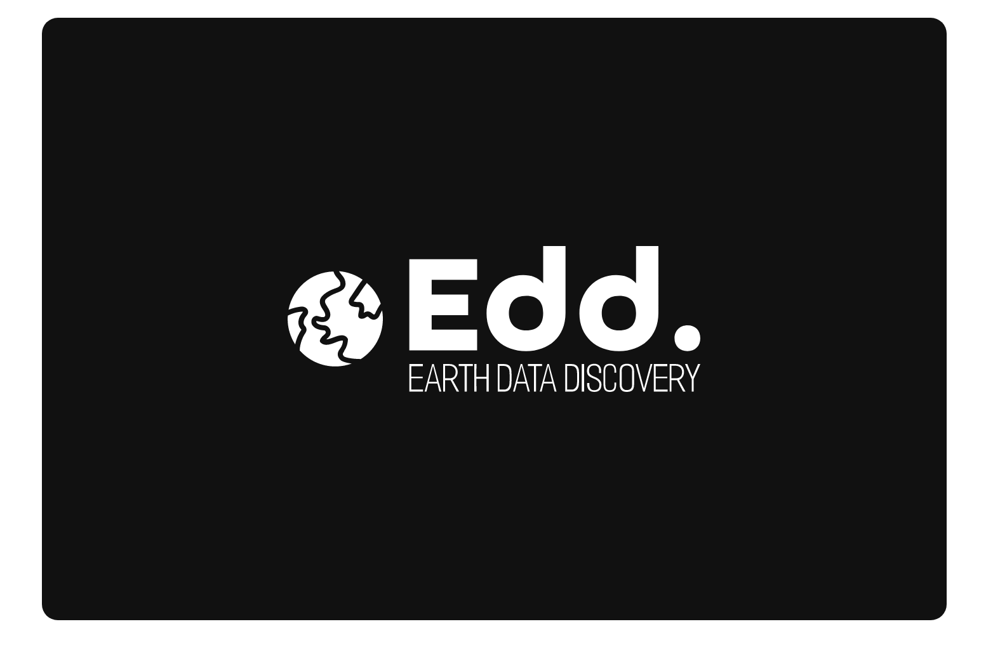
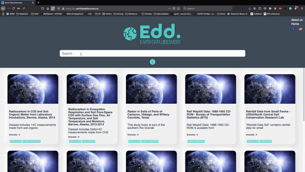

<p align="center">
  
</p>

<h1 align="center">EARTH DATA COLLECTOR</h1>

<p align="center">
  A repository from the <a href="https://earthdatadiscovery.co/">Earth Data Discovery Project</a>
</p>
<br>
<p align="center">
  
</p>

## PROJECT

This repository is part of a project created by the [Earth Data Discovery Team](https://2020.spaceappschallenge.org/challenges/connect/data-discovery-earth-science/teams/edd/members) for the [2020 Space Apps Challenge](https://2020.spaceappschallenge.org).

### The Challenge

Our team decided to address the [Data Discovery for Earth Science](https://2020.spaceappschallenge.org/challenges/connect/data-discovery-earth-science/details) Challenge":

> This challenge will ask you to devise a tool or technique to guide users to relevant datasets to study specific events.

The goal of our project is to make Earth Science Data easily accessible for everyone. 
We think that finding a database for any project should be a simple, fast and straight forward process, that doesn't require lots of expertise or previous knowledge.
In order to reach this goal, we provide a search and visualization interface, providing information about publicly available databases from the main Space Agencies over the world.

Our main goals:

- Provide an instant, relevant and typo tolerant search engine for Earth Science datasets.
- Provide an intuitive, simple yet rich interface for finding the dataset that fit your needs.

<h1 align="center">ABOUT THIS REPOSITORY</h1>

The goal of this repository is to fetch data from the [CMR Earth Data](https://cmr.earthdata.nasa.gov) and index it into a [MeiliSearch](https://github.com/meilisearch/MeiliSearch) search Engine.

This is a necesary step to create an accessible and open interface for finding Earth Science datasets.

## HOW TO USE IT

### Preparing your environment

#### Clone the repository and install dependencies. You need `python 3` and `pip`

```bash
git clone https://github.com/earthdatadiscovery/earth-data-collector.git
cd earth-data-collector
pip install -r requirements.txt
```

#### RUN A MEILISEARCH INSTANCE

Here we use a docker image, but there are other ways to [install here](https://docs.meilisearch.com/guides/introduction/quick_start_guide.html#getting-started)

```bash
docker run -it -p 7700:7700 --name MeiliEarthData getmeili/meilisearch:latest ./meilisearch
```

#### ADD YOUR MEILISEARCH SETTINGS

You need to set up your MeiliSearch URL (and eventually the API Key if you want to use one) in `services/meilisearch/meilisearch.py`

#### RUN IT! GO GO GO!

```bash
python collector.py
```
